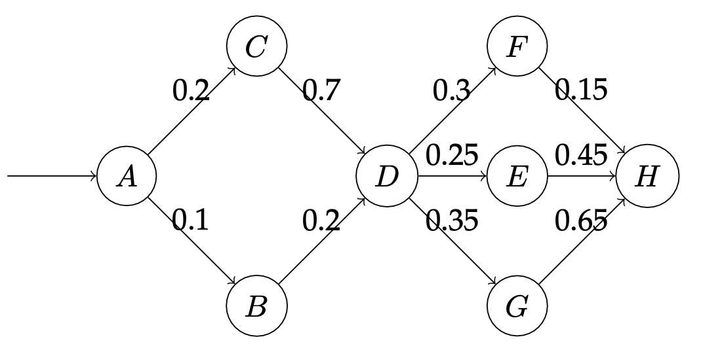

1. TOC
{:toc}

**Note**: This project is not yet finalized.

# Project overview

The goal in this project is to implement your own discrete probabilistic
programming language. The skeleton code for the project is available on GitHub:

[https://github.com/neuppl/disc](https://github.com/neuppl/disc)****

**Due date**: The project is due **Tuesday Oct. 3** at 11:59PM EST. If you require an extension, email 
the instructor.

**Rubric**: The project will be evaluated according to following rubric:

* 70% Correctness
  - A score of 100% is given for this category if all included tests in the GitHub repository are passed.
  - If not all tests pass, partial credit will be assigned according to the percentage of tests that are passed.
* 30% Final writeup
  - Include solutions to the modeling exercises. These are graded on a pass/no-pass scale.
  - Please give us some feedback for future iterations on this project.

**What to turn in**: On Canvas, turn in the following:

* A `.zip` file containing your project. We should be able to unzip this file and run `dune build` in order to build.
* A `.pdf` file containing your solutions to the modeling exercises. 

**Questions**: Please e-mail any questions about build setup or the assignment itself to Minsung at `minsung AT ccs.neu.edu`.
# Syntax

The `disc` language is a simple PPL that consists purely of Boolean random 
values.
The syntax is given as two inductively defined terms: expressions `e` 
and programs `p`. A program is simply a designated start expression with no free variables. 
It has the following syntax:

```
e ::=
   | x <- e; e
   | observe e; e
   | flip q                         // q is a rational value
   | if e then e else e
   | return e
   | true | false
   | e && e | e || e | ! e |
   | ( e )

p ::= e
```

So for instance, we can write the following program in `disc`:

```
x <- flip 0.6; 
y <- flip 0.3;
observe x || y;
return x
```

This program flips two coins and observes the outcome of at least one of them to
be true, then returns the posterior probability of coin `x` being true. The 
resulting posterior is:

$$
\frac{0.6 \times 0.3 + 0.6 \times 0.3}{0.6 \times 0.3 +0.6\times0.3+0.4\times0.3} \approx 0.8333333.
$$

# Semantics
The semantics for the probabilistic terms associates each term with an 
unnormalized probability distribution
It has the type $[[e]] : \texttt{Bool} \rightarrow [0, 1]$,
and has the following inductive definition:

$$
[\![\texttt{flip}~\theta]\!](v) = 
\begin{cases}
\theta& \quad \text{if }v = T\\
1-\theta& \quad \text{if }v = F\\
\end{cases}
$$

$$
 [\![\texttt{return}~e]\!](v) = 
 \begin{cases}
 1\quad& \text{if }v = [\![e]\!]\\
 0\quad&  \text{otherwise}\\
 \end{cases}
$$

$$
[\![x \leftarrow e_1; e_2]\!](v) = \sum_{v'} [\![{e_1}]\!](v') \times [\![{e_2[x \mapsto v']}]\!](v)
$$

$$
[\![\texttt{observe}~e_1; e_2]\!](v) = 
\sum_{\{v' \mid [\![{e_1}(v') = T\}]\!]} [\![{e_2}]\!](v)
$$

The semantics for non-probabilistic terms is standard. The semantic evaluation has type 
$[[e]]: \texttt{Bool}$ for closed terms.

These semantics give an unnormalized distribution. The main semantic object of interest is 
the normalized distribution, which is given by the *normalized semantics*:

$$
[\![e]\!]_D(T) = \frac{[\![e]\!](T)}{[\![e]\!](T) + [\![e]\!](F) },
$$

defined analogously for the false case.

# Inference

You will be required to implement two inference algorithms for this project: (1) exact inference 
by enumeration, and (2) knowledge compilation based inference.

## Enumeration

For this section we will be implementing exact inference via exhaustive enumeration. We will 
be filling in the `lib/enumerate.ml` file. Your solution should implement the `infer` function 
in this file.

Enumeration can be described as a big-step relation $e \Downarrow (\alpha, \beta)$ where $\alpha$ 
is the unnormalized true probability and $\beta$ is the unnormalized false probability.
The adequacy requirement that this relation should satisfy is, if $e \Downarrow (\alpha, \beta)$, then:

$$
[\![ e ]\!]_D(T) = \frac{\alpha}{\alpha + \beta}
$$

This relation is described inductively:

$$\frac{}{\texttt{flip}~\theta \Downarrow (\theta, 1-\theta)}$$

$$
\frac{e_1 \Downarrow (\alpha_1, \beta_1) \quad e_2[x \mapsto T] \Downarrow (\alpha_2, \beta_2) \quad e_2[x \mapsto F] \Downarrow (\alpha_3, \beta_3)}
{x \leftarrow e_1; e_2 \Downarrow (\alpha_1\alpha_2 + \beta_1\alpha_3, \alpha_1\beta_2 + \beta_1\beta_3 )}
$$

$$
\frac{}
{\texttt{observe}~F; e_2 \Downarrow (0, 0)}
$$

$$
\frac{e_1 \Downarrow (\alpha, \beta)}
{\texttt{observe}~T; e_2 \Downarrow (\alpha, \beta)}
$$

Hint: What kinds of expressions should go in the `observe` statements? In the bindings? What is the semantics of `observe (flip 0.5)`?

## Knowledge compilation
For this section we will be implementing exact inference via knowledge compilation. We will 
be filling in the `lib/kc.ml` file. Your solution should implement the `infer` function 
in this file.
Knowledge compilation can be described as a big-step relation $e \Downarrow (\varphi, \gamma, w)$ where $\varphi$ 
and $\gamma$ are Boolean formulae and $w$ is a weight function.
The invariant that these Boolean formulae should satisfy is that, for $e \Downarrow (\varphi, \gamma, w)$ 
the following holds:

$$
[\![ e ]\!]_D(T) = \frac{\texttt{WMC}(\varphi \land \gamma, w)}{\texttt{WMC}(\gamma, w)}
$$

The compilation relation is as follows:

$$\frac{\texttt{fresh variable }\ell}{\texttt{flip}~\theta \Downarrow (\ell, T, [\ell \mapsto \theta, \overline{\ell}\mapsto 1-\theta])}$$

$$\frac{g \Downarrow (\varphi_g, \gamma_g, w_g) \quad t \Downarrow (\varphi_t, \gamma_t, w_t) \quad e \Downarrow (\varphi_e, \gamma_e, w_e)}{\texttt{if}~g~\texttt{then}~t~\texttt{else}~e \Downarrow ((\varphi_g \land \varphi_t) \lor (\neg\varphi_g \land \varphi_e), (\varphi_g \land \gamma_t) \lor (\neg\varphi_g \land \gamma_e), w_g \cup w_t \cup w_e)}$$

$$
\frac{e_1 \Downarrow (\varphi_1, \gamma_1, w_1) \quad e_2 \Downarrow (\varphi_2, \gamma_2, w_2)}
{x \leftarrow e_1; e_2 \Downarrow (\varphi_2[x \mapsto \varphi_1], \gamma_2[x \mapsto \gamma_1], w_1 \cup w_2)}
$$

To build Boolean formulas and weight functions, we will be using the `rsdd` library. See a tutorial [here.](https://www.khoury.northeastern.edu/home/sholtzen/CS7470Fall23/projects/rsdd.html)

# Modeling exercises

## The Monty Hall Problem

The Monty Hall problem is a classic "paradox" in probability theory. Here's a shamelessly stolen Wikipedia description of the dilemma:  

Suppose you're on a game show, and you're given the choice of three doors: Behind one door is a car; behind the others, goats. You pick a door, say No. 1, and the host, who knows what's behind the doors, opens another door, say No. 3, which has a goat. He then says to you, "Do you want to pick door No. 2?" Is it to your advantage to switch your choice?

Your task is to make several `.disc` files that answers the host's question for you:

  1. In a file named `3doors.disc`, make a `disc` program that represents the scenario in which you pick Door No. 1 before the host opens Door No. 3. The program should output the probability of winning the car.
  
  2. In a file named `no_switch.disc`, make a `disc` program representing the scenario immediately after the host reveals a goat behind Door No. 3. The program should output the probability of winning the car provided we do not switch.
   
  3.  In a file named `yes_switch.disc`, make a `disc` program representing the scenario immediately after the host reveals a goat behind Door No. 3. The program should output the probability of winning the car provided we do switch.

Hint: If your program output for `no_switch.disc` or `yes_switch.disc` is 0.5 then it is wrong.

## Network Reliability



The directed graph above gives an abstract view of a
computer network. The goal in a network like this is to deliver a packet
-- piece of data -- from one router to another by passing it through
intermediate routers in the graph. Each node is a router, and each directed edge
is a link from one router to another. Packets always begin at $A$.

In the real world there is often some uncertainty in the behavior of such a
network. Assume that each link has a failure probability given by its
annotation; for instance, the probability that a packet traversing the link $A
\rightarrow C$ fails to be delivered is 0.2. Furthermore, assume that, when
given multiple options, a router will choose uniformly at random which
router to forward to; for instance, if the packet is at node $A$, then at the
next step it will have a 50% chance of being at node $C$ and a 50% chance of
being at node $B$. Use your `disc` implementation and exact inference to
answer the following questions about this network's behavior:


  1. What is the probability that a packet successfully reaches $H$? Include
    your `disc` file in the report.
  2. If packet reached $H$, what is the probability that the packet reached
    $C$? Include your `disc` file in the report.
  3. If the packet did not reach $F$ or $G$, what is the probability that it
    reached $D$?
  4. Suppose I can fix a single edge to never drop a packet. Which edge
    should I fix to maximize the probability that a packet reaches $H$, and what
    is the probability that $H$ is reached in this new fixed network?

# Extensions

For your final course project you may choose to extend `disc` in some way. Here are some suggestions 
for how to improve or extend `disc`:

* Develop and benchmark compiler optimizations.
* Extend `disc` to handle bounded and possibly unbounded loops.